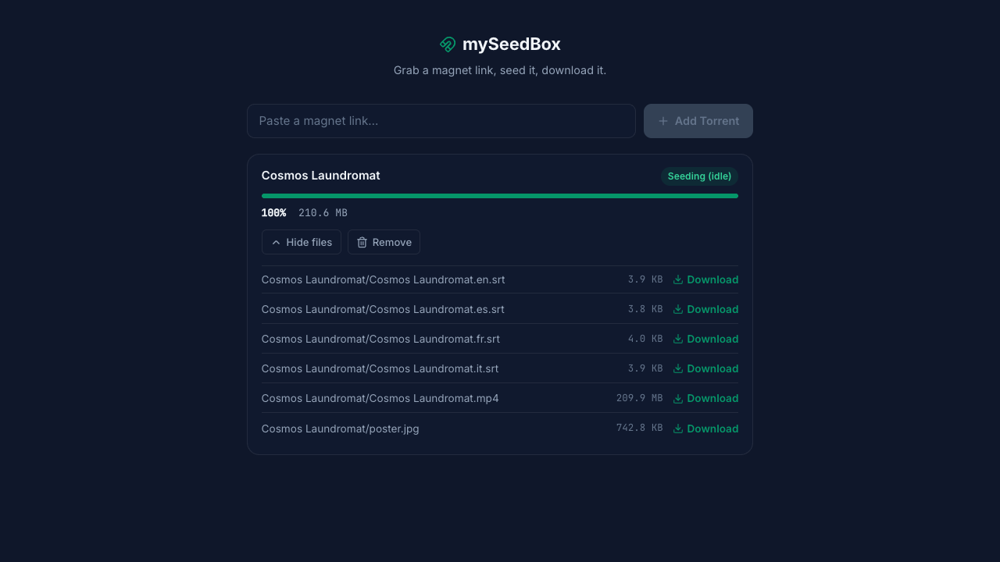

<p align="center">
  
</p>

<h1 align="center">mySeedBox</h1>

A self-hosted seedbox: paste a magnet link, let [qBittorrent](https://www.qbittorrent.org/) download and seed it, and grab the finished files from a clean web UI. **Runs entirely on your own machine** — no cloud, no accounts, just Docker.



## How it works

```
┌──────────────┐      REST       ┌──────────────┐     WebUI API    ┌──────────────┐
│  Vue frontend │ ───────────────▶│ FastAPI backend│ ───────────────▶│  qBittorrent  │
│  (port 5173) │◀─────────────── │  (port 8000)   │◀─────────────── │  (port 8080)  │
└──────────────┘   progress/JSON └──────────────┘   torrent status  └──────────────┘
                                                                              │
                                                                              ▼
                                                                     shared ./data/downloads
                                                                     (backend streams files
                                                                      from here to the browser)
```

- **qBittorrent** does the actual downloading/seeding.
- **FastAPI backend** wraps qBittorrent's Web API — add a magnet, list torrents, list files, stream a completed file back to the browser.
- **Vue frontend** is the UI: add a magnet link, watch live progress, download finished files.

All three run as containers, defined in a single `docker-compose.yml` at the project root.

## Tech stack

| Layer | Stack |
|---|---|
| Frontend | Vue 3 (Composition API, `<script setup>`), TypeScript, Vite, Pinia, Vue Router |
| Backend | FastAPI, httpx, Pydantic Settings |
| Torrent engine | qBittorrent (headless) |
| Runtime | Docker Compose (all three services) |

## Prerequisites

- [Docker Desktop](https://www.docker.com/products/docker-desktop/) — that's it. Node/pnpm/Python/uv are only needed if you want to run a service outside Docker for development (see below).

## Quick start

Everything runs with one command, but qBittorrent needs its Web UI password set on first run before the backend can authenticate against it — so the very first setup takes two steps.

### 1. First-time setup

```bash
docker compose up -d qbittorrent
docker compose logs qbittorrent | grep -i password   # copy the temporary password
```

Open [http://localhost:8080](http://localhost:8080), log in as `admin` with that temporary password, and set a permanent one under **Tools → Options → Web UI**. Then create the backend's env file with those credentials:

```bash
cp mySeedBoxBE/.env.example mySeedBoxBE/.env
# edit mySeedBoxBE/.env and set QBIT_PASSWORD to the password you just set
```

### 2. Run everything

```bash
docker compose up -d --build
```

That's it — qBittorrent, the API, and the UI are all up. Open [http://localhost:5173](http://localhost:5173), paste a magnet link, and watch it download.

| Service | URL |
|---|---|
| Frontend | http://localhost:5173 |
| Backend API (docs at `/docs`) | http://localhost:8000 |
| qBittorrent Web UI | http://localhost:8080 |

To stop everything: `docker compose down` (add `-v` only if you also want to wipe qBittorrent's saved config — downloaded files in `./data/downloads` are untouched either way).

After pulling code changes, rebuild with `docker compose up -d --build`.

## Developing a single service outside Docker

Docker is the easiest way to just *run* the app, but for active development with instant hot-reload you may want to run one service natively while the rest stay in Docker:

```bash
# Backend, with auto-reload:
cd mySeedBoxBE
cp .env.example .env   # fill in QBIT_PASSWORD; QBIT_URL=http://localhost:8080
uv sync
uv run uvicorn main:app --reload --port 8000

# Frontend, with HMR:
cd mySeedBoxFE
cp .env.example .env   # defaults already point at localhost:8000
pnpm install
pnpm run dev
```

Just stop the corresponding container first (e.g. `docker compose stop backend`) so the ports don't clash.

## Environment variables

**`mySeedBoxBE/.env`**

| Variable | Default | Description |
|---|---|---|
| `QBIT_URL` | `http://localhost:8080` | qBittorrent Web UI base URL (set automatically to `http://qbittorrent:8080` when run via Docker Compose) |
| `QBIT_USERNAME` | `admin` | qBittorrent Web UI username |
| `QBIT_PASSWORD` | — | qBittorrent Web UI password |

**`mySeedBoxFE/.env`**

| Variable | Default | Description |
|---|---|---|
| `VITE_API_BASE_URL` | `http://localhost:8000` | Base URL of the FastAPI backend |

## API overview

| Method | Path | Description |
|---|---|---|
| `GET` | `/api/health` | Checks connectivity to qBittorrent |
| `POST` | `/api/torrents` | Add a torrent by magnet link |
| `GET` | `/api/torrents` | List all torrents with live progress |
| `GET` | `/api/torrents/{hash}` | Get a single torrent's status |
| `DELETE` | `/api/torrents/{hash}` | Remove a torrent |
| `GET` | `/api/torrents/{hash}/files` | List files inside a torrent |
| `GET` | `/api/torrents/{hash}/download?file_name=...` | Stream a completed file |

## Project structure

```
my seed box/
├── docker-compose.yml     # qbittorrent + backend + frontend
├── data/                  # shared runtime volume (gitignored)
│   ├── downloads/         # completed/in-progress torrent files
│   └── qbittorrent-config/
├── mySeedBoxBE/           # FastAPI backend
│   ├── Dockerfile
│   └── app/
│       ├── config.py      # settings (reads .env)
│       ├── qbittorrent.py # qBittorrent Web API client
│       ├── schemas.py     # Pydantic response models
│       └── main.py        # API routes
└── mySeedBoxFE/           # Vue frontend
    ├── Dockerfile
    └── src/
        ├── api/           # typed fetch wrapper for the backend
        ├── composables/   # useTorrents() — polling + state
        ├── components/torrents/
        └── utils/
```

## Roadmap

- [ ] Tests (backend + frontend)
- [ ] Torrent categories / multi-file selection UI
- [ ] Hosted deployment (out of scope for now — local-only)
